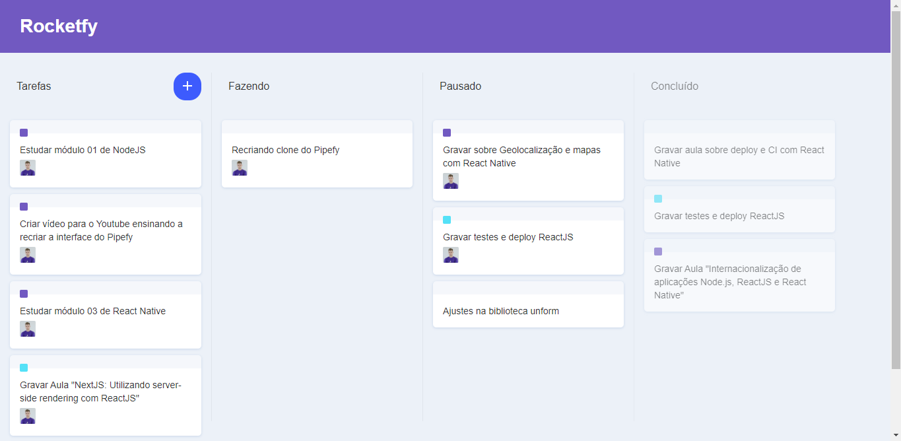

# Rocketfy



This project was built following [this video](https://www.youtube.com/watch?v=awRtgpRsdTQ)!

I built this project in order to remember the basics of React.JS and the fundamentals of drag and drop and I'll use this knowledge developing an incredible platform in the future.

## How to run the repo

- Fork or clone the repo where you want
- ```cd rocketfy``` to enter the directory
- Run ```yarn```
- Wait Yarn to install all dependencies
- ```yarn start``` to start the development
- Wait until it opens localhost:3000
- Happy hacking!